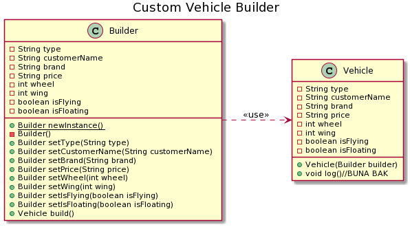

=== *Builder*

*Builder Pattern*, bizi olusturulacak nesnede, parametrelerin durumlarina gore, karmasik ve gereksiz yapici fonksiyonlarin tanimlanmasindan kurtarir. Olusturulacak sinifin icine bir yapici sinif eklenir. Bu sekilde *Vehicle* sinifi, icinde bulunan *Builder* sinifinin fonksiyonlari ile birden fazla yapici fonskyionuna gerek kalmadan uretilir.

=== UML

==== *Vehicle.java*

*Vehicle* sinifi ve *Builder* ic sinifinin bulundugu java dosyasidir.

[source,java]
-----------------

public class Vehicle {
	
	private String type; <1>
	private String customerName;
	private String brand;
	private String price;
	private int wheel;
	private int wing;
	private boolean isFlying;
	private boolean isFloating;
	
	public Vehicle(Builder builder) { <2>
		this.type = builder.type;
		this.customerName = builder.customerName;
		this.brand = builder.brand;
		this.price = builder.price;
		this.wheel = builder.wheel;
		this.wing = builder.wing;
		this.isFlying = builder.isFlying;
		this.isFloating = builder.isFloating;
	}
	
	public static class Builder{ 

		private String type; <3>
		private String customerName;
		private String brand;
		private String price;
		private int wheel;
		private int wing;
		private boolean isFlying;
		private boolean isFloating;
		
		
		public static Builder newInstance() { <4>
			return new Builder();
		} 

		public Builder setType(String type) { <5>
			this.type = type;
			return this;
		}
		public Builder setCustomerName(String customerName) {
			this.customerName = customerName;
			return this;
		}
		public Builder setBrand(String brand) {
			this.brand = brand;
			return this;
		}
		public Builder setPrice(String price) {
			this.price = price;
			return this;
		}
		public Builder setWheel(int wheel) {
			this.wheel = wheel;
			return this;
		}
		public Builder setWing(int wing) {
			this.wing = wing;
			return this;
		}
		public Builder setIsFlying(boolean isFlying) {
			this.isFlying = isFlying;
			return this;
		}
		public Builder setIsFloating(boolean isFloating) {
			this.isFloating = isFloating;
			return this;
		}
		public Vehicle build() { <6>
			return new Vehicle(this);
		}
	}
	
	public void log() { <7>
		System.out.println("vehicle: "+this);
		System.out.println("type : "+type);
		System.out.println("customerName : "+customerName);
		System.out.println("brand : "+brand);
		System.out.println("price : "+price+"TL");
		System.out.println("wheel : "+wheel);
		System.out.println("wing : "+wing);
		System.out.println("isFlying : "+isFlying);
		System.out.println("isFloating : "+isFloating);
		System.out.println("");
	}
}
}

-----------------
<1> Olusturulacak nesnenin parametreleri bos tanimlanir. 
<2> *Builder* sinifini parametre alan yapici fonksiyonudur. Gelen parametrenin degerlerini kendi degiskenlerine atar.
<3> *Vehicle* sinifindaki degiskenleri, *Builder* sinifi ile atanmasi icin tanimlanirlar. 
<4> *Builder* sinifini new ile turetmemek icin kullanilan fonksiyondur. Kullanildiginda yeni bir *Builder* nesnesi uretilir.
<5> *Builder* sinifinin degiskenlerinin degistirildigi *setter* fonksiyonlari.
<6> *Builder* ile yapilandirma bittikten sonra nesneyi olusturmak icin kullanilan fonksiyondur. Ayarlanan Builder sinifini bir *Vehicle* olarak dondurur.
<7> Vehicle sinifinin bilgilerini ekrana yazan fonksiyondur.

