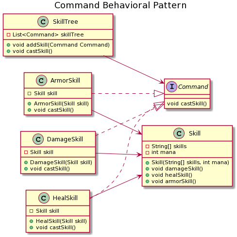
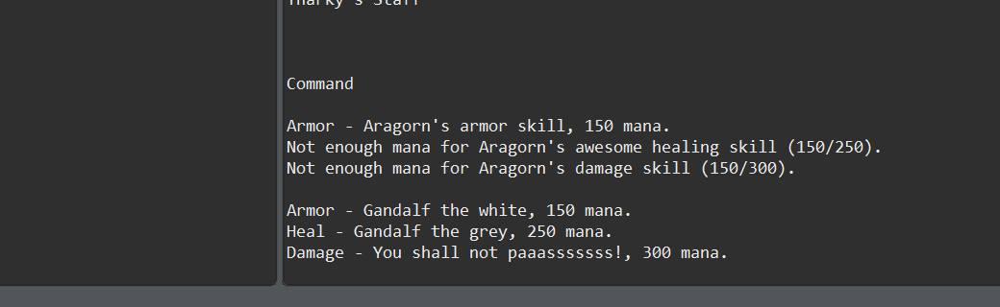

=== *COMMAND BEHAVIORAL PATTERN*

Command Pattern, kullanici isteklerini gerceklestiren kod yapisinin sarmalanarak nesnelere halinda saklanmasina dayanir. Gerceklestirilmek istenen islemler bir nesne olarak sarmalanir. Ayni kod yapisinin tekrar tekrar kullanilabilmesine olanak saglar.

Senaryoda surekli kullanilacak uc sinif bulunuyor.  Uc sinif da davranissal olarak sadece sahip oldugu fonksiyonu calistiriyor. Bu nedenle bu fonksiyonlari komut geldiginde cagiran bir kalip kullandim.

=== UML

==== *Command.java*

Command arayuz sinfidir. Komutlarin execute edecegi fonksiyonu barindirir.

[source,java]
-----------------
public interface Command {
	void castSkill(); <1>
}
-----------------
<1> Implement edecek siniflarin override edecegi komut isleme fonksiyonudur.

==== *ArmorSkill.java*

Command arayuzunu implement eder.

[source,java]
-----------------
public class ArmorSkill implements Command{
	private Skill skill;
	public ArmorSkill(Skill skill) { this.skill = skill; } 
	@Override
	public void castSkill() { skill.armorSkill(); } <1>
}
-----------------
<1> Yapici fonksiyondan gelen skill objesinin armorSkill fonksiyonunu cagirir.

==== *DamageSkill.java*

Command arayuzunu implement eder.

[source,java]
-----------------
public class DamageSkill implements Command{	
	private Skill skill;
	public DamageSkill(Skill skill) { this.skill = skill; }
	@Override
	public void castSkill() { skill.damageSkill(); } <1>
}
-----------------
<1> Yapici fonksiyondan gelen skill objesinin damageSkill fonksiyonunu cagirir.

==== *HealSkill.java*

Command arayuzunu implement eder.

[source,java]
-----------------
public class HealSkill implements Command {
	private Skill skill;
	public HealSkill(Skill skill) { this.skill = skill; }	
	@Override
	public void castSkill() { skill.healSkill(); }	<1>
}
-----------------
<1> Yapici fonksiyondan gelen skill objesinin healSkill fonksiyonunu cagirir.

==== *Skill.java*

Komutla calisan siniflarin, yapici fonksiyonlarindan alip invoke ettigi sinif Skill sinifidir.

[source,java]
-----------------
public class Skill {
    ...

	public void damageSkill() { <1>
		if( mana >= 300 ) {
			System.out.println("Damage - "+skills[0]+", 300 mana.");
		}else System.out.println("Not enough mana for "+skills[0]+" ("+mana+"/300).");
		
	}
	public void healSkill() { <2>
		if( mana >= 250 ) {
			System.out.println("Heal - "+skills[1]+", 250 mana.");
		}else System.out.println("Not enough mana for "+skills[1]+" ("+mana+"/250).");
	}
	public void armorSkill() { <3>
		if( mana >= 150 ) {
			System.out.println("Armor - "+skills[2]+", 150 mana.");
		}else System.out.println("Not enough mana for "+skills[2]+" ("+mana+"/150).");
	}

    ...
}
-----------------
<1> DagameSkill sinifinda invoke edilen fonksiyondur.
<2> HealSkill sinifinda invoke edilen fonksiyondur.
<3> ArmorSkill sinifinda invoke edilen fonksiyondur.

==== *SkillTree.java*

Komutlarin icerisindeki listede saklanip, tek fonksiyonla tum komutlarin calistirildigi siniftir.

[source,java]
-----------------
public class SkillTree {
	private List<Command> skillTree = new ArrayList<Command>(); <1>
	public void addSkill(Command Command) { <2>
		skillTree.add(Command);
	}
	public void castSkill() { <3>
		for( Command order: skillTree) { order.castSkill(); }
		skillTree.clear();
	}	
}
-----------------
<1> addSkill fonksiyonundan gelen komutu tutacak liste degiskenidir.
<2> Parametre olarak gelen komutu skillTree listesine ekler.
<3> Listedeki komutlari isler. Ardindan listeyi temizler.

=== *Output*

Bu sekilde bir sinifin yetenekleri tek komutla calisabilmektedir.

