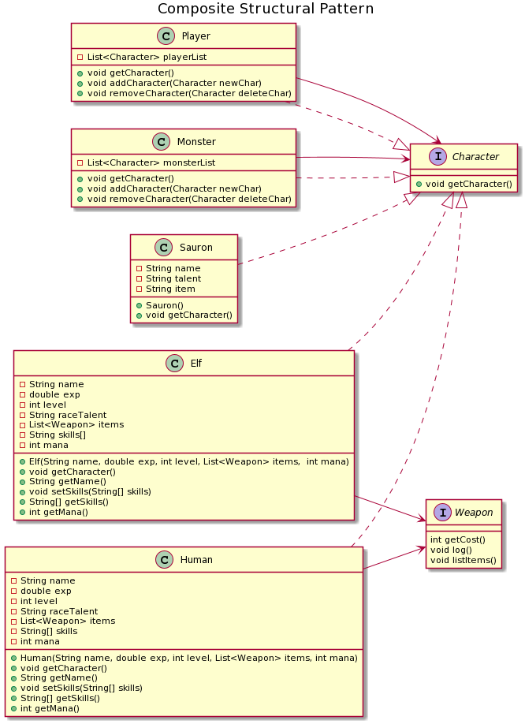
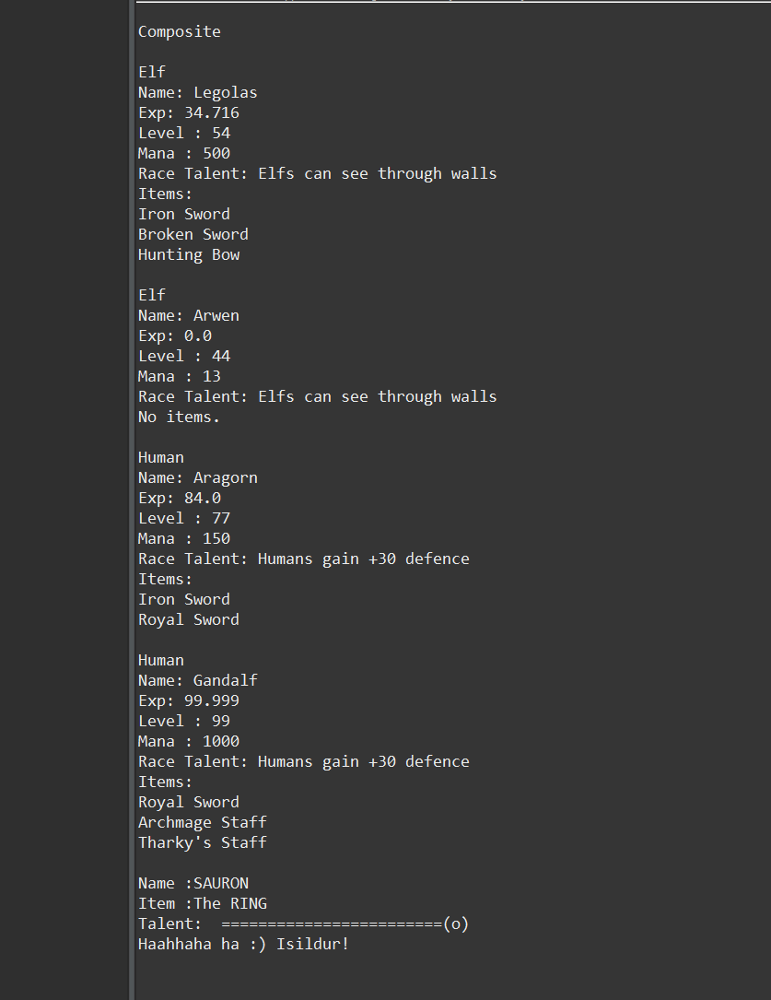

=== *COMPOSITE STRUCTURAL PATTERN*

Composite Pattern, birbirlerinden farkli olan nesnelerin tek bir butun nesneymis gibi kullanilmasini saglayan kaliptir. Composite Pattern'in amaci nesneleri bir agac yapisinda birlestirip, uygulamadaki parca butun iliskisini sekillendirmektir.

Kullandigim siniflar birbirleri ile parent-child iliskisi icinde tek nesne olarak kullanilabildiginden bu kalibi kullandim. Siniflarin hiyerarsisi:

 -Monster
 --Sauron 
 -Player
 --Human
 ---Gandalf
 ---Aragorn
 --Elf
 ---Legolas
 ---Arwen
 
seklindedir. 

=== UML

==== *Character.java*

Canlilarin implement edildigi arayuzdur.

[source,java]
-----------------
public interface Character {
	public void getCharacter(); <1>
}
-----------------
<1> Override edilecek fonksiyon.

==== *Player.java*

Character arayuzunu implement eder. Yaprak sinifi olan Human ve Elf siniflarinin bagli oldugu parent siniftir.

[source,java]
-----------------
public class Player implements Character {
	private List<Character> playerList = new ArrayList<Character>();        <1>
	@Override
	public void getCharacter() {
		for( Character character:playerList ) {     <2>
			character.getCharacter();	
		}
	}
	public void addCharacter(Character newChar) { playerList.add(newChar); } <3>
	public void removeCharacter(Character deleteChar) { playerList.remove(deleteChar); } <4>
    }
	
-----------------
<1> Player sinifina baglanacak cocuk siniflarin listesidir.
<2> playerList listesindeki cocuk siniflari tek tek donerek bilgilerini ekrana yazdiran fonksiyondur.
<3> playerList listesine yeni cocuk eklenir.
<4> playerList listesinden parametre verilen cocuk sinif cikarilir.

==== *Monster.java*

Character arayuzunu implement eder. Yaprak sinifi olan Sauron'un bagli oldugu parent siniftir.

[source,java]
-----------------
public class Monster implements Character {	
	private List<Character> monsterList = new ArrayList<Character>();        <1>
	@Override
	public void getCharacter() {
		for( Character character:monsterList ) {     <2>
			character.getCharacter();
		}
	}
	public void addCharacter(Character newChar) { monsterList.add(newChar); } <3>
	public void removeCharacter(Character deleteChar) { monsterList.remove(deleteChar); } <4>
}
-----------------
<1> Player sinifina baglanacak cocuk siniflarin listesidir.
<2> playerList listesindeki cocuk siniflari tek tek donerek bilgilerini ekrana yazdiran fonksiyondur.
<3> playerList listesine yeni cocuk eklenir.
<4> playerList listesinden parametre verilen cocuk sinif cikarilir.

==== *Human.java*

Human yaprak sinifidir.

[source,java]
-----------------
public class Human implements Character {	
    ...

    	@Override
	public void getCharacter() { <1>
		System.out.println("\nHuman"+"\nName: " +name +"\nExp: "+exp+"\nLevel : "+level+"\nMana : "+mana+"\nRace Talent: "+raceTalent);
		if( items.size() != 0){
			System.out.println("Items:");
			 for (Weapon weapon: items) {
				 weapon.listItems();
			 } 
		}else System.out.println("No items.");
	}

    ...
}
-----------------
<1> Arayuzdeki getCharacter fonksiyonu override edilir.

==== *Elf.java*

Elf yaprak sinifidir.

[source,java]
-----------------
public class Elf implements Character {	
    ...

	@Override
	public void getCharacter() { <1>
		System.out.println("\nElf"+"\nName: " +name +"\nExp: "+exp+"\nLevel : "+level+"\nMana : "+mana+"\nRace Talent: "+raceTalent);
		if( items.size() != 0){
			System.out.println("Items:");
			 for (Weapon weapon: items) {
				 weapon.listItems();
			 } 
		}else System.out.println("No items.");	
	}

    ...
}
-----------------
<1> Arayuzdeki getCharacter fonksiyonu override edilir.

==== *Sauron.java*

Sauron yaprak sinifidir.

[source,java]
-----------------
public class Sauron implements Character {	
    ...

    	@Override
	public void getCharacter() { <1>
		System.out.println("\nName :"+name+"\nItem :" +item+"\nTalent: "+talent+"\nHaahhaha ha :) Isildur!");
	}

    ...
}
-----------------
<1> Arayuzdeki getCharacter fonksiyonu override edilir.

=== *Output*

Karakterler ortak parentlarda toplanarak bir agac yapisi olustururlar. Bu sekilde nesnelerin kullanimi ve kontrolu daha duzenli ve kolay hale gelmistir.

