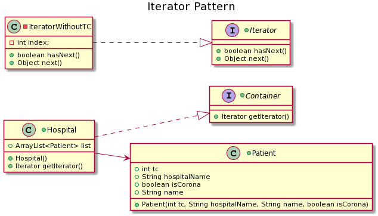

=== *Iterator Pattern*

Iterator Pattern, birlesik bir nesnenin bilesenlerine, nesnenin esas ifadesinin gosterimini aciga cikarmadan sirayla erisebilmeyi saglar.

=== UML

==== *Container.java*

[source,java]
-----------------
public interface Container {
	public Iterator getIterator(); <1>
}
-----------------
<1> Override edilecek getIterator fonksiyonu tanimlanir.

==== *Iterator.java*

Vehicle Interface'ini implement eder.

[source,java]
-----------------
public interface Iterator {
	public boolean hasNext(); <1>
	public Object next();	<2>
}
-----------------
<1> Objede baska eleman kalip kalmadigini bulur.
<2> Mevcut indexteki elemani dondurup sonraki indexe gecen fonksiyondur.

==== *Hospital.java*

Hasta listesinin tutuldugu, container fonksiyonunun override edildigi ve Iterator sinifinin tanimlandigi siniftir.

[source,java]
-----------------
public class Hospital implements Container{

		public ArrayList<Patient> list = new ArrayList<Patient>(); <1>
		
		public Hospital() {	 <2>
			list.add( new Patient(111,"umuttepe","ali",false) );
			list.add( new Patient(222,"seka devlet","ayse",true) );
			list.add( new Patient(333,"kocaeli devlet","ahmet",false) );
			list.add( new Patient(444,"umuttepe","adnan",true) );
			list.add( new Patient(555,"seka devlet","alp",true) );
			list.add( new Patient(666,"kocaeli devlet","ata",true) );
		}
		
	   @Override
	   public Iterator getIterator() { <3>
	      return new IteratorWithoutTC();
	   }
	   
	   private class IteratorWithoutTC implements Iterator {

		      private int index; <4>

		      @Override
		      public boolean hasNext() { <5>
		      
		         if(index < list.size()){
		            return true;
		         }
		         return false;
		      }

		      @Override
		      public Object next() { <6>
		      
		         if(this.hasNext()){
		        	 return list.get(index).name+" "+list.get(index).hospitalName+" "+list.get(index++).isCorona;
		         }
		         return null;
		      }		
		   }
}
-----------------
<1> Hastalarin tutulacagi liste verisi.
<2> Hastalarin listeye eklendigi kurucu fonksiyon.
<3> Override edilen ve IteratorWithoutTC donduren fonksiyon.
<4> Iterator index tanimlanir.
<5> Listede bir sonraki indexte eleman kalip kalmadigini bulan fonksiyondur.
<6> Mevcut indexteki objenin bilgilerini dondurup indexi artiran fonksiyondur.

==== *Patient.java*

Listede gezilecek obje sinifi olan Hasta sinifidir.

[source,java]
-----------------
public class Patient { <1>
	public int tc;
	public String hospitalName;
	public boolean isCorona;
	public String name;
	
	public Patient(int tc, String hospitalName, String name, boolean isCorona) { <2>
		this.tc = tc;
		this.hospitalName = hospitalName;
		this.isCorona = isCorona;
		this.name = name;
	}
	

}
-----------------
<1> Hasta global verileridir.
<2> Hasta global verilerinin eklendigi kurucu fonksiyondur.
