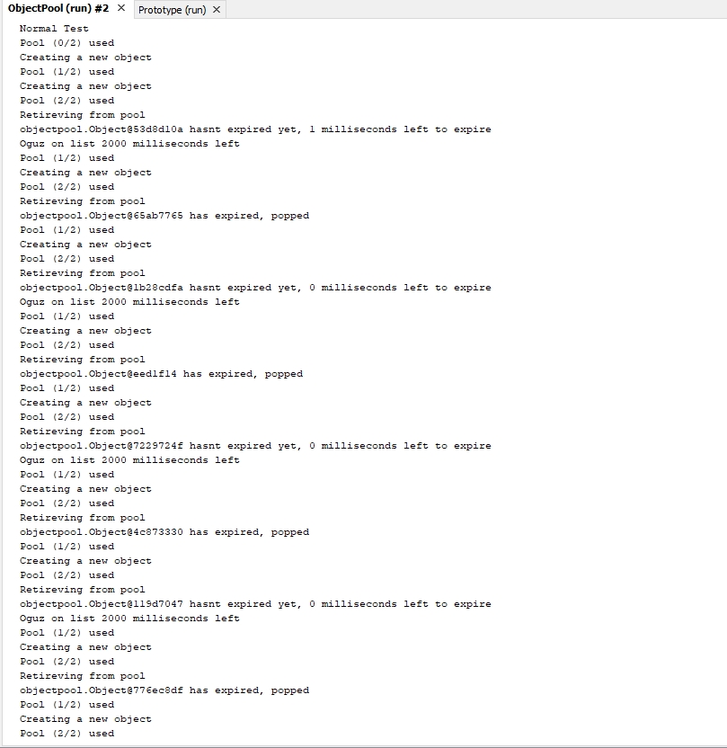

=== *Object Pool*

Ortak ozelliklere sahip nesneler uretilirken, nesneleri tek bir noktadan ureterek kod fazlaliginin onune gecen bir tasarim kalibidir.

==== *Object Pool.java*

Havuz buyuklugu ve doluluguna gore isterlere nesne dondurur

[source,java]
-----------------

    private long expirationTime; <1>
    private long w8Time; <2>
    LinkedList<Object> list; <3>
    private static ObjectPool instance; <4>
    private static int size; <5>
    private String name; <6>
    private Long now; <7>

    private ObjectPool(){ <8>
        expirationTime = 1000;
        w8Time = 2000;
        size = 2;
        list  = new LinkedList<>(); 
    }

    synchronized public static ObjectPool getInstance(){ <9>
        if(instance==null)
            instance = new ObjectPool();    
        return instance;
    }
    
    public synchronized Object getObject(String name) throws InterruptedException{
        now = System.currentTimeMillis(); <10>
        Object obj;
        this.name = name;
        if(list.size() >= size){ <11>
            System.out.println("Pool ("+list.size()+"/"+size+") used");
            System.out.println("Retireving from pool");
            obj = getFromPool(name);
        }else{
            System.out.println("Pool ("+list.size()+"/"+size+") used");
            System.out.println("Creating a new object");
            obj = createNewObj();
        }
        return obj;
    }
    
    public Object getFromPool(String name) throws InterruptedException{
        long objNow = list.get(0).getNow(); <12>
        if((now - objNow) > expirationTime ){ <13>
            System.out.println(list.get(0)+" has expired, popped");
            Object obj;
            obj = list.pop();
            return obj;
        }else{
            System.out.println(list.get(0) +" hasnt expired yet, "+(now-objNow)+" milliseconds left to expire");
            System.out.println(name+" on list "+w8Time+" milliseconds left");
            Thread.sleep(w8Time);
            Object obj;
            obj = list.pop();
            return obj;
        }
    }
    
    public Object createNewObj(){ <14>
        Object obj = new Object();
        list.add(obj);
        return obj;
    }
 }
    
-----------------

<1> Havuz kullanim suresidir
<2> Kullanicinin havuzun bosalmasi icin bekledigi sure
<3> Havuzdaki objelerin bulundugu FIFO LinkList
<4> Singleton ornegi
<5> Havuz boyutu
<6> Havuzu kullanmak isteyen kullanicinin adi
<7> Mevcut zamani tutan degisken
<8> Private constructor ile degiskenler tanimlandi
<9> Singleton icin kullanilan, nesneyi donduren fonksiyon
<10> 7. maddedeki deger tanimlanir
<11> Liste boyutu havuz boyutundan fazla veya esit ise *getFromPool* az ise *createNewObj* fonksiyonunu calistirir
<12> Listedeki ilk elemanin olusturulma suresini tutan degisken
<13> Ilk olusturulan objenin mevcut zamanla farki hesaplanir. 1.maddedeki degerden fazla ise direkt listeden ilk eleman cikartilir ve yeni kullaniciya yer acilir. Eger az ise 2.maddedeki deger kadar kullanici bekletilir ve ardindan listeden ilk eleman cikartilir.
<14> Havuzda bos yer oldugunda calisan fonksiyon. Kullaniciya yeni bir obje dondurur.

==== *Object.java*

Kullanicilarin erisecegi siniftir. Olusturuldugunda mevcut zamani saklar. Bu sayede bekleme ve listeden cikarilma islemleri yapilir.

[source,java]
-----------------

    ...

    private Long now; <1>

       public Object() {
           now = System.currentTimeMillis(); <2>
       }

    ...
}
    
-----------------

<1> Obje olusturuldugundaki zamani tutacak eleman
<2> Obje olusturuldugunda mevcut zaman 1.maddedeki elemana atanir

==== *MultiThreading.java*

Threading test sinifidir

[source,java]
-----------------

    ...

    try{
        System.out.println ();
        System.out.println("Thread"+Thread.currentThread().getId()+" is running");
        ObjectPool pool = ObjectPool.getInstance();
        for(int i=0; i<100; i++){
        Object obj = pool.getObject("Oguz1337");
        System.out.println ();
        }
    ...
}
    
-----------------

==== *ObjectPool_Main.java*

Test main sinifidir

[source,java]
-----------------

    ...

    ObjectPool pool = ObjectPool.getInstance(); <1>
    System.out.println ("Normal Test");
    for(int i=0; i<100; i++)
    Object obj = pool.getObject("Oguz"); 
            
    System.out.println ();
    System.out.println ("Threading Test");
    for(int i=0; i<100; i++){
        Thread thread = new Thread(new MultiThreading()); <2>
            thread.start();
        }
    ...
}
    
-----------------

<1> Singleton ObjectPool sinifi new kullanilmadan olusturulur.
<2> Threading ile test

=== Output

