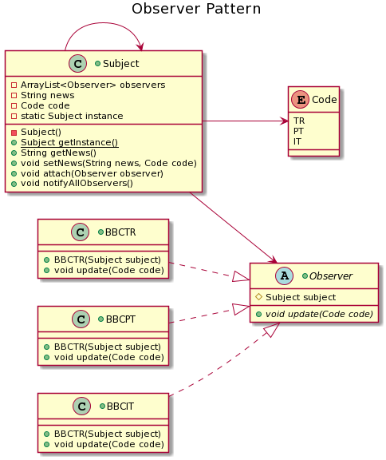

=== *Observer Pattern*

Gozlemlenen obje degistiginde, o objeyi gozlemleyen gozlemcileri uyaran bir tasarim kalibidir.

=== UML

==== *Observer.java*

Gozleyecek siniflarin extend ettigi gozlemci abstract sinifidir.

[source,java]
-----------------
public abstract class Observer {
	   protected Subject subject; <1>
	   public abstract void update(Code code); <2>
	   enum Code 
	   { 
	       TR, PT, IT; 
	   } 
}
-----------------
<1> Degisince gozlemcilerin uyarildigi objedir.
<2> Gozlemcilerin uyarildigi fonksiyondur.

==== *Subject.java*

Gozleyecek siniflarin extend ettigi gozlemci abstract sinifidir.

[source,java]
-----------------
public class Subject {
	   private ArrayList<Observer> observers = new ArrayList<Observer>(); <1>
	   private String news; <2>
	   private Code code; 
	   private static Subject instance;
	   private Subject() {}
	   public static Subject getInstance() {
		   if(instance == null) {
			   synchronized (Subject.class) {
				   if(instance == null) {
					   instance = new Subject();
				   }
			   }
		   }
		return instance;
	   }
	   public String getNews() { <3>
	      return news;
	   }
	   public void setNews(String news, Code code) { <4>
	      this.news = news;
	      this.code = code;
	      notifyAllObservers();
	   }
	   public void attach(Observer observer){ <5>
	      observers.add(observer);		
	   }
	   public void notifyAllObservers(){ <6>
	      for (Observer observer : observers) {
	         observer.update(code);
	      }
	   } 	
	}
-----------------
<1> Gozlemcilerin tutuldugu gozlemci listesi
<2> Haber degiskeni
<3> Haberi donduren fonksiyondur.
<4> Haberin ve haberin dilinin belirlendigi fonksiyondur.
<5> Gozlemcinin listeye eklendigi fonksiyondur.
<6> Degisiklikte gozlemci listesinde sirayla tum gozlemcilerin uyarildigi fonksiyondur.

==== *BBCTR.java*

Gozlemci sinifidir.

[source,java]
-----------------
public class BBCTR extends Observer{
	public BBCTR(Subject subject) {
		this.subject = subject;
		this.subject.attach(this);
	}
	@Override <1>
	public void update(Code code) {
		if(code.toString().equals("TR"))
		System.out.println( code.toString()+ " | BBC Yeni Haber: " + subject.getNews()); 
	}
}
-----------------
<1> Guncellemeyle degisen haberin kodu TR ise haberi yayinlar.

==== *BBCPT.java*

Gozlemci sinifidir.

[source,java]
-----------------
public class BBCPT extends Observer{	
	
	...

	@Override
	public void update(Code code) { <1>
		if(code.toString().equals("PT"))
		System.out.println( code.toString()+ " | BBC Novas Not�cias: " + subject.getNews()); 
	}

}
-----------------
<1> Guncellemeyle degisen haberin kodu PT ise haberi yayinlar.

==== *BBCIT.java*

Gozlemci sinifidir.

[source,java]
-----------------
public class BBCIT extends Observer{

	...

	@Override
	public void update(Code code) { <1>
		if(code.toString().equals("IT"))
		System.out.println( code.toString()+ " | BBC nuove notizie " + subject.getNews()); 
	}
	
}
-----------------
<1> Guncellemeyle degisen haberin kodu IT ise haberi yayinlar.