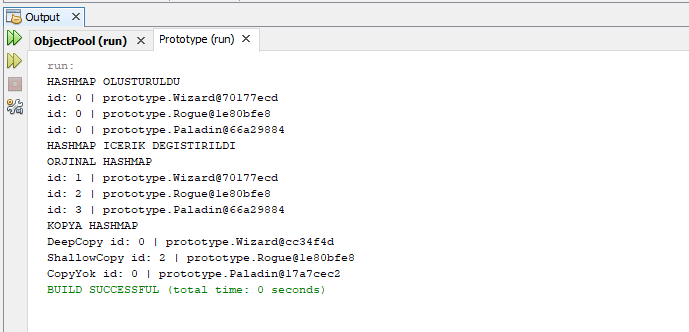

=== *Prototype*

Prototype, ayni nesneden birden cok ihtiyac olmasi durumda her nesne icin *new* ile turetilmesi yerine ilk turetilen nesnenin kopyalanarak cogaltilmasidir.

==== *Character.java*

Uretilecek siniflarin ortak ozelliklerini aldigi Interface sinifidir.
*Deep* ve *shallow* copy burada yapilir.

[source,java]
-----------------

    public abstract class Character implements Cloneable { <1>

    ...

    public Object shallow(){  
    Object clone = this; <2>
    return clone;
    }
    
    ...

    public Object clone() throws CloneNotSupportedException {
    Object clone = null;
    try {
        clone = super.clone(); <3>
        } catch (CloneNotSupportedException e) {
         e.printStackTrace();
      }
      return clone;
   }

    ...
 }
    
-----------------
<1> Clonable, deep copy fonksiyonu clone icin implemente edilir
<2> Shallow copy
<3> Deep copy

==== *Prototype_Main*

Test main sinifidir

[source,java]
-----------------

public class Prototype_Main {
    public static void main(String[] args) throws CloneNotSupportedException {        
        HashMap<String, Character> list = new HashMap<>(); <1>
        
        list.put("1", new Wizard());
        list.put("2", new Rogue());  <2>
        list.put("3", new Paladin());
       
        System.out.println("HASHMAP OLUSTURULDU");
        list.forEach((key, value) -> {
            System.out.println("id: "+value.getId()+" | "+ value);
        });
        
        HashMap<String, Character> listCloned = new HashMap<>(); <3>
        listCloned.put("1", (Character) list.get("1").clone());  <4>
        listCloned.put("2", (Character) list.get("2").shallow()); <5>
        listCloned.put("3", new Paladin()); 
        
        System.out.println("HASHMAP ICERIK DEGISTIRILDI");
        list.get("1").setId(1);
        list.get("2").setId(2);
        list.get("3").setId(3);
        System.out.println("ORJINAL HASHMAP");
        list.forEach((key, value) -> {
            System.out.println("id: "+value.getId()+" | "+ value);
        });
        System.out.println("KOPYA HASHMAP");
        System.out.println("DeepCopy id: "+listCloned.get("1").getId()+" | "+ listCloned.get("1"));
        System.out.println("ShallowCopy id: "+listCloned.get("2").getId()+" | "+ listCloned.get("2"));
        System.out.println("CopyYok id: "+listCloned.get("3").getId()+" | "+ listCloned.get("3"));
    }
    
}
    
-----------------

<1> Objeleri tutacak hashmap listesi olusturuldu
<2> Listeye siniflar eklendi
<3> Klonlanacak ikinci hashmap olusturuldu
<4> Listenin ilk elemani clone fonksiyonu ile deep copy
<5> Listenin ikinci elemani shallow fonksiyonu ile shallow copy

=== Output

