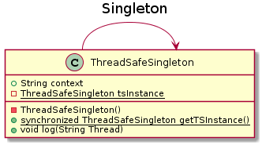

=== *Singleton*

Singleton bir defa olusturulmasi yeterli olan nesneler icin kullanilir

=== UML

=== *Thread-Safe Singleton*

Bu yakalsimda Singleton sinifinin kullanildigi fonksyion synchronized anahtariyla kitlenir. Bu sayede bir thread'in isi bitmeden diger thread bu bloga erisemez.

[source,java]
-----------------
public class ThreadSafeSingleton {
public String context = "TS Singleton Context"; <1>
    private static ThreadSafeSingleton tsInstance; <2>
    private ThreadSafeSingleton(){} <3>
    public static synchronized ThreadSafeSingleton getTSInstance(){ <4> 
        if (tsInstance == null) tsInstance = new ThreadSafeSingleton(); <5>
        return tsInstance;
    }
    public void log(String Thread){ System.out.println(Thread+" "+context); } <6>
}

-----------------
<1> Singleton icerigini tutar.
<2> Statik Singleton ornegi olusturulur
<3> Private constructor tanimlanir. Bu sayede sinif new anahtariyla kullanilamaz.
<4> Singleton bu fonksiyon ile cagirilir. Fonksiyonda bulunan synchronized anahtari ile bu fonksiyon ayni anda birden fazla calisamaz.
<5> Singleton'in daha once olusturulup olusturulmadigini kontrol eder, bu sayede ikinci bir ornegi olusmaz.
Eger ornek null ise yeni bir Singleton olusturur ve dondurur, eger null degilse mevcut ornegi dondurur.
<6> Singleton icerigini thread ismiyle birlikte yazar.